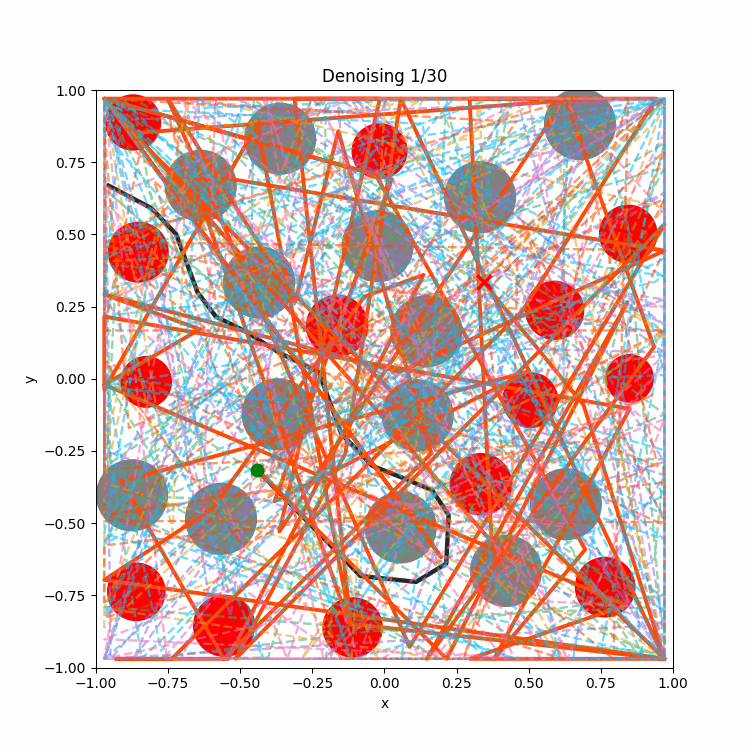

# Topological Motion Planning Diffusion: Generative Tangle-Free Path Planning for Tethered Robots in Obstacle-Rich Environments

Tian, Y.; Xu, X.; Nguyen, T.-M.; Cao, M. (2026). **_Topological Motion Planning Diffusion: Generative Tangle-Free Path Planning for Tethered Robots in Obstacle-Rich Environments_**, submitted to IEEE/RSJ International Conference on Intelligent Robots and Systems (IROS).

[](https://arxiv.org/pdf/2603.26696)

<p align="center">
  
</p>

---
This repository implements `TMPD` (Topological Motion Planning Diffusion), a diffusion-based method for tethered robot path planning in obstacle-rich environments, submitted to IROS 2026.

**NOTES**

This codebase is developed based on the [mpd-public](https://github.com/joaoamcarvalho/mpd-public/tree/main).

If you have any questions, please contact: [yifutian@link.cuhk.edu.cn](mailto:yifutian@link.cuhk.edu.cn)

---
## Installation

Pre-requisites:
- Ubuntu 20.04
- [miniconda](https://docs.conda.io/projects/miniconda/en/latest/index.html)

Clone this repository with:
```bash
cd ~
git clone --recurse-submodules https://github.com/Yifu-Tian/tmpd-public.git
cd tmpd-public
```

Download [IsaacGym Preview 4](https://developer.nvidia.com/isaac-gym) and extract it under `deps/isaacgym`:
```bash
mv ~/Downloads/IsaacGym_Preview_4_Package.tar.gz ~/tmpd-public/deps/
cd ~/tmpd-public/deps
tar -xvf IsaacGym_Preview_4_Package.tar.gz
```

Run the setup script to install dependencies:
```bash
cd ~/tmpd-public
bash setup.sh
```

---
## Running TMPD and baselines

To run TMPD / baseline inference, first download trajectories and trained models.

```bash
conda activate mpd
```

From the repository root:
```bash
# `--id` is deprecated in recent gdown, direct URL form is recommended
gdown "https://drive.google.com/uc?id=1mmJAFg6M2I1OozZcyueKp_AP0HHkCq2k" -O data_trajectories.tar.gz
tar -xvf data_trajectories.tar.gz
gdown "https://drive.google.com/uc?id=1I66PJ5QudCqIZ2Xy4P8e-iRBA8-e2zO1" -O data_trained_models.tar.gz
tar -xvf data_trained_models.tar.gz
```

Expected folders after extraction:
- `data_trajectories/`
- `data_trained_models/`

Run benchmark scripts individually:
```bash
cd scripts/inference/benchmarks
python run_astar.py
python run_rrt.py
python run_mpd.py
python run_tmpd.py
```

Run the full benchmark + plotting pipeline:
```bash
cd scripts/inference
bash run_benchmark.sh
```

Interactive TMPD demo:
```bash
cd scripts/inference
python inference.py
```

Optional plotting (1x4 comparison figures):
```bash
cd scripts/inference
python plotting/plot_all.py
```

Results are generated under repository-level `results/` by default. Some scripts also support overriding output via `--results_dir`.

Expected model file check (important):
```bash
ls data_trained_models/EnvDense2D-RobotPointMass/args.yaml
ls data_trained_models/EnvSimple2D-RobotPointMass2D/args.yaml
```

If these files are missing, extraction is incomplete or the directory layout is different from what benchmark scripts expect.

---
## Generate data and train from scratch

We recommend running the following in a SLURM cluster for large-scale experiments.

```bash
conda activate mpd
```

To regenerate trajectory data:
```bash
cd scripts/generate_data
python launch_generate_trajectories.py
```

To train diffusion models:
```bash
cd scripts/train_diffusion
python launch_train_01.py
```

---
## Repository structure

```text
mpd/                          # Core modules (models, trainer, environments, utils)
mpd/environments/             # Dynamic benchmark environments (extra objects)
mpd/utils/topology_utils.py   # Topology signature, energy, taut curve, safety checks
scripts/generate_data/        # Data generation pipeline
scripts/train_diffusion/      # Diffusion training pipeline
scripts/inference/inference.py
scripts/inference/benchmarks/ # run_astar.py / run_rrt.py / run_mpd.py / run_tmpd.py
scripts/inference/plotting/   # plot_all.py
scripts/inference/run_benchmark.sh
results/                      # Benchmark outputs (plots, logs, shared trial data)
```

---
## Citation

If you use our work or code base(s), please cite:
```latex
@article{tian2026tmpd,
  title={Topological Motion Planning Diffusion: Generative Tangle-Free Path Planning for Tethered Robots in Obstacle-Rich Environments},
  author={Tian, Yifu and Xu, Xinhang and Nguyen, Thien-Minh and Cao, Muqing},
  journal={arXiv preprint arXiv:2603.26696},
  year={2026},
  note={Submitted to IEEE/RSJ International Conference on Intelligent Robots and Systems (IROS)},
  url={https://arxiv.org/pdf/2603.26696}
}
```

If you also build on MPD, please additionally cite:
```latex
@inproceedings{carvalho2023mpd,
  title={Motion Planning Diffusion: Learning and Planning of Robot Motions with Diffusion Models},
  author={Carvalho, J. and Le, A.T. and Baierl, M. and Koert, D. and Peters, J.},
  booktitle={IEEE/RSJ International Conference on Intelligent Robots and Systems (IROS)},
  year={2023}
}
```
